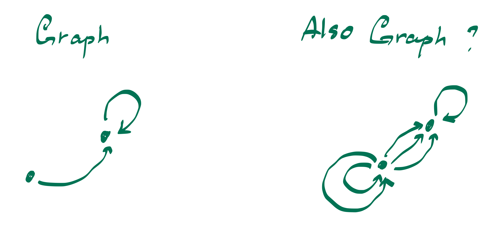
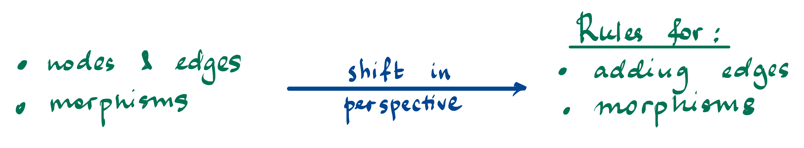
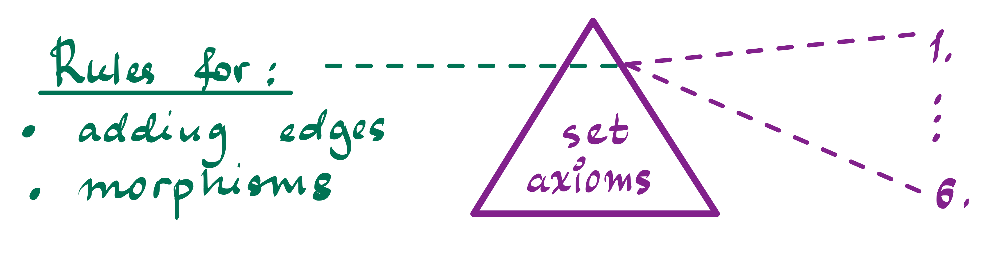

# A Study of Concrete Categorizations of Graphs
*guest post by [Maria Ramos]() and [Aya Samadzelkava]()

**Introduction**
1. why understanding and looking at the structure of graph types is useful? (A)   
3. what is this classification/stuctcure? fig 1,2 (M)
4. what are set axioms and why are they useful for comparison? table
   3.1.
   3.2.
   3.3.
   3.4.
   3.5.
   3.6.

# 1. 
Imagine looking at two drawings side by side: on the left, a small, loopless network with just a few edges; on the right, a more tangled structure—complete with multiple edges linking the same vertices and perhaps a loop or two. While both are "graphs", they look and behave quite differently. The rules governing what counts as an “edge” or a “loop” can vary widely from one definition to another. This ambiguity is why we talk about types of graphs.

We have a similar ambiguity when we talk about graph morphisms - a way to map one graph into another. While both exmaples below represent morphisms, the rules they follow are quite different.  On the left, you see a “strict” morphism that matches each vertex and edge precisely, preserving the structure down to the last detail. On the right, a more relaxed morphism allows edges to “collapse” or be identified in a simpler way—perhaps merging two edges into one if they serve the same role. Both are legitimate ways to interpret “graph morphisms,” yet they impose very different constraints on how graphs can transform.

At first glance, it may seem that studying nodes and edges directly is enough. But these pictures nudge us to shift our perspective. We start thinking less about the specific shapes of graphs and more about the *rules* that define them. For instance, is more than one edge between two vertices allowed? Can loops exist? Does a morphism have to map edges to edges, or can it send edges to vertices? Each choice leads to a different notion of “graph,” and correspondingly different morphisms.

Why formalize these rules? One reason is that we can bring them under the umbrella of the familiar set-theoretic framework. Each graph type is essentially a set of vertices plus a certain structure/set of rules that go with it. By classifying the ways we treat edges and morphisms, we’re using these set axioms to impose universal properties: do we have products of graphs in this category? Are there exponentials? How do we form subobjects? In effect, we are leveraging the fundamental language of sets to build consistent categories of graphs.

Finally, one might ask: Why bother? The short answer is that this classification opens up a broader toolbox for both theory and applications. When you know exactly which “graph type” and which "morphism type" you are dealing with — whether it’s a simple loopless graph or a general graph with flexible morphisms — you gain clarity about what kind of constructions and transformations are valid. This in turn leads to powerful insights in modeling complex systems: from simplifying a transportation network by merging parallel routes (a more relaxed morphism) to analyzing a strict hierarchy of relationships (a strict morphism). By understanding the deeper logic that emerges from set axioms and universal constructions, you not only unify different graph definitions under one conceptual roof but also enable the transfer of results across seemingly disparate areas. 

When we examine graphs through the lens of categories and their rules, we shift our focus from listing nodes and edges to uncovering the universal constructions that exist and universal properties that govern how they combine and interact. An example of this are Lawvere's set axioms that allow to say "if satisfied an object, this object can do whatever a set can do". This approach treats graphs as objects defined by a set of rules that dictate everything from the multiplicity of connections to the ways in which graphs can be transformed via morphisms.
At the heart of this perspective is the realization that set axioms provide a common language for defining structure. For example, by imposing axioms that specify limits, colimits, or even exponential objects, we can rigorously classify graph types. What emerges on the “other side” of this prism is a collection of universal properties that reveal which constructions are possible in a given category of graphs. 
These properties might tell us, for instance, whether the category supports an internal notion of a “function space”. For a graph category where this rule holds, we can construct an internal “function space” that represents all morphisms from one graph to another.  Having this structure is tremendously useful when you want to, say, build models of network evolution where the “rules” of transformation can themselves be studied categorically. Conversely, if the rule fails, it tells you that such internal homs do not exist, so you must resort to external, less intrinsic methods to analyze the space of graph mappings. This outcome is not merely a theoretical curiosity—it directly affects how one designs algorithms for network analysis and transformation.

In short, by filtering graph definitions through set axioms, we gain a clear, abstract blueprint of how graphs behave and interact.

